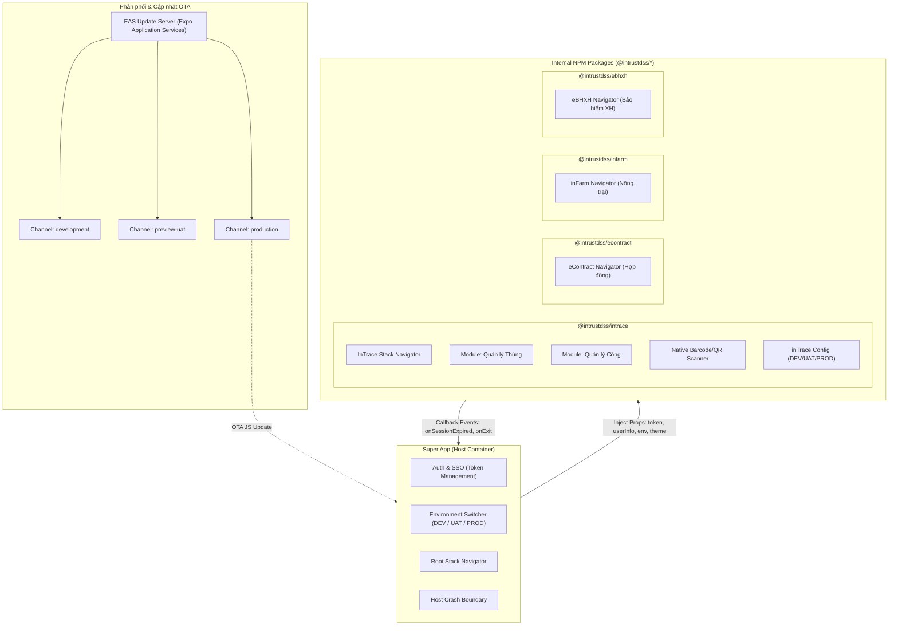
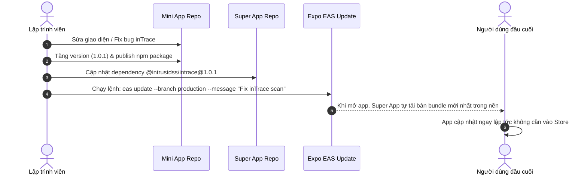

# intrustDSS Super App - Architecture & Design System

Tài liệu này mô tả chi tiết kiến trúc kỹ thuật của hệ thống **Super App intrustDSS**, được xây dựng trên nền tảng **React Native & Expo**. Hệ thống sử dụng mô hình **Modular Micro-Frontends** (mỗi app con là một thư viện độc lập) nhằm phân chia trách nhiệm rõ ràng giữa các đội ngũ phát triển (`inTrace`, `eContract`, `inFarm`, `eBHXH`).

---

## 1. Tổng quan Kiến trúc (High-Level Architecture)



---

## 2. Nguyên lý Hoạt động & Phân quyền

### 2.1. Độc lập Repository & Đóng gói NPM
- Mỗi mini-app nằm trên một Git repository độc lập (hoặc monorepo package) với tên định danh nội bộ:
  - `@intrustdss/intrace`
  - `@intrustdss/econtract`
  - `@intrustdss/infarm`
  - `@intrustdss/ebhxh`
- App tổng (`super-app`) khai báo các mini-app như một dependency thông thường trong `package.json`.
- Các mini-app **không sở hữu runtime riêng trong App tổng**, chúng chỉ export ra **React Component / Stack Navigator** và hợp đồng dữ liệu (**Props Interface**).

### 2.2. Luồng truyền dữ liệu (Data Bridge)

| Chiều truyền | Dữ liệu | Mục đích |
| :--- | :--- | :--- |
| **Host $\rightarrow$ Mini App** | `token` (JWT/Bearer) | Xác thực danh tính người dùng trong các cuộc gọi API con |
| **Host $\rightarrow$ Mini App** | `userInfo` | Hiển thị tên, avatar, công ty, phân quyền phòng ban |
| **Host $\rightarrow$ Mini App** | `environment` (`dev` \| `uat` \| `prod`) | Định tuyến endpoint API con về đúng máy chủ backend tương ứng |
| **Host $\rightarrow$ Mini App** | `theme` | Đồng bộ màu chủ đạo, chế độ Dark/Light mode |
| **Mini App $\rightarrow$ Host** | `onSessionExpired()` | Báo cho App tổng biết token hết hạn để đẩy ra màn hình Login chính |
| **Mini App $\rightarrow$ Host** | `onExitMiniApp()` | Báo cho App tổng biết người dùng muốn quay lại trang chủ Super App |

---

## 3. Kiến trúc Đa Môi Trường qua File Cấu Hình (DEV / UAT / PROD)

> [!IMPORTANT]
> **Quy tắc bảo mật & vận hành:** Không đặt nút chuyển đổi môi trường trên giao diện người dùng (UI). Mọi thông số kết nối (Domain, API Gateway, API Key, Client ID) phải được cô lập thành các file cấu hình chuyên biệt và nạp tự động theo bản build hoặc biến môi trường `APP_ENV`.

```
src/config/
├── types.ts      # Khai báo schema cấu hình chuẩn (Domain, API Gateway, API Keys, Mini Apps)
├── env.dev.ts    # Cấu hình máy chủ DEV (dev.intrustdss.vn & dev keys)
├── env.uat.ts    # Cấu hình máy chủ UAT/Staging (uat.intrustdss.vn & uat keys)
├── env.prod.ts   # Cấu hình máy chủ Production chính thức (intrustdss.vn & live keys)
└── env.ts        # Module tự động phân giải cấu hình kích hoạt dựa theo biến môi trường
```

### Quy tắc định danh cấu hình (Schema):
```typescript
export interface MiniAppEndpointConfig {
  apiBaseUrl: string;
  apiKey: string;
  timeoutMs?: number;
}

export interface SuperAppEnvironmentConfig {
  envName: 'dev' | 'uat' | 'prod';
  displayName: string;
  domain: string;
  gatewayUrl: string;
  authUrl: string;
  apiKey: string;
  clientId: string;
  enableDebugLogs: boolean;
  timeoutMs: number;
  miniApps: {
    intrace: MiniAppEndpointConfig;
    econtract: MiniAppEndpointConfig;
    infarm: MiniAppEndpointConfig;
    ebhxh: MiniAppEndpointConfig;
  };
}
```

### Khởi chạy theo môi trường:
- `npm run start:dev` $\rightarrow$ Nạp `env.dev.ts`
- `npm run start:uat` $\rightarrow$ Nạp `env.uat.ts`
- `npm run start:prod` $\rightarrow$ Nạp `env.prod.ts`
- Khi build qua EAS, trường `"env": { "APP_ENV": "..." }` trong `eas.json` sẽ tự động tiêm giá trị tương ứng vào bundle.

---

## 4. Cơ chế Cập nhật Tức thì OTA (EAS Update)

EAS Update cho phép cập nhật code JavaScript và Assets hình ảnh trực tiếp vào máy người dùng mà không cần duyệt lại qua Apple App Store hay Google Play Store:



### Điều kiện để OTA thành công:
1. **Không thay đổi Native code** (không thêm native module mới mà binary chưa có).
2. Mã `runtimeVersion` giữa bản build binary và bản update phải tương thích (sử dụng policy `appVersion` hoặc `fingerprint`).

---

## 5. Chiến lược Native Module & Camera Scanner cho inTrace

### Vì sao bản Web khó xử lý và giải pháp Native trong Expo:
- **Bản Web (`frontend-dev`):** Trình duyệt web trên di động bị hạn chế quyền truy cập phần cứng sâu, luồng xử lý qua WebRTC/Canvas/Wasm rất ngốn CPU/RAM, lấy nét (autofocus) chậm và không bật/tắt được đèn Flash (Torch) ổn định trên mọi dòng máy.
- **Bản Mobile Native (Expo Camera):**
  - Dùng trực tiếp hệ thống quét mã vạch của hệ điều hành (Apple AVFoundation trên iOS và Google MLKit / CameraX trên Android).
  - Tốc độ nhận diện tức thì (< 30ms), nhận diện chuẩn cả khi mã Barcode/QR bị mờ, méo, tối.
  - Tích hợp sẵn nút bật/tắt đèn Flash (Torch) native phục vụ công nhân quét hàng trong kho/container thiếu sáng.
  - Không cần custom phức tạp: chỉ cần component `CameraView` với thuộc tính `barcodeScannerSettings` là đạt hiệu năng tối đa.

---

## 6. Kiến trúc Phân tầng (Layered Architecture) & Độc lập Dự án

Nhằm phục vụ việc bàn giao độc lập cho từng nhóm phát triển riêng biệt, cả **Super App (Host)** và từng **Mini App (`packages/*`)** đều áp dụng cấu trúc phân tầng rõ ràng:

### 6.1. Nguyên tắc Phân tầng (Separation of Concerns):
- **API / Services Layer (`src/api`, `src/services`)**: Chuyên trách toàn bộ HTTP request, API endpoints, headers xác thực, tuyệt đối không gọi `fetch` hay `axios` trực tiếp trong component màn hình.
- **Navigation Layer (`src/navigation`)**: Tách biệt luồng điều hướng (`Stack.Navigator`, route params) khỏi file khởi chạy gốc (`App.tsx`).
- **State & Hooks Layer (`src/hooks`)**: Chứa custom hooks đóng gói logic phiên làm việc (`useAuthSession`) và nghiệp vụ tái sử dụng.
- **Theme & Constants (`src/constants`)**: Bảng màu (`COLORS`), khoảng cách (`SPACING`), bo góc (`RADIUS`) được quản lý tập trung, không hardcode mã màu trong StyleSheet.
- **Types Layer (`src/types`)**: Định nghĩa toàn bộ interfaces, DTOs, đảm bảo tính Type-Safety giữa Host và Mini Apps.
- **Utils Layer (`src/utils`)**: Chứa các hàm tiện ích thuần túy (formatters, validators).

### 6.2. Cấu hình Độc Lập cho Từng Repository:
Mỗi dự án (`super-app` và từng mini-app trong `packages/`) sở hữu bộ cấu hình độc lập đặt ngay tại thư mục của dự án đó:
- `tsconfig.json`: Quản lý TypeScript, path alias (`@/*`) và phạm vi kiểm tra type độc lập.
- `.eslintrc.js`: Bộ quy tắc kiểm tra cú pháp và chất lượng mã nguồn riêng cho từng team.
- `.prettierrc`: Định dạng code thống nhất (tab, dấu nháy, độ rộng dòng).

