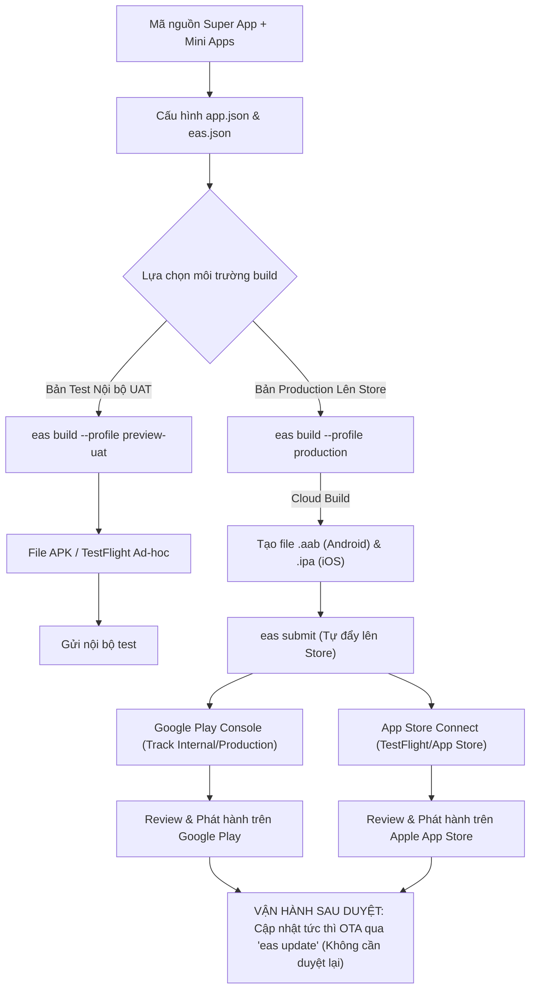

# Hướng Dẫn Triển Khai App Lên Apple App Store & Google Play Store

Tài liệu này giải đáp chi tiết câu hỏi: **"Deploy lên App Store & Google Play có phức tạp không?"** và cung cấp **Quy trình triển khai thực tế từ A-Z** cho hệ thống Super App intrustDSS sử dụng nền tảng **Expo Application Services (EAS)**.

---

## 1. Đánh giá: Có phức tạp không?

### 🟢 Về mặt Kỹ thuật: **KHÔNG PHỨC TẠP** (Đã giảm 80% nhờ Expo & EAS)
* **Không bắt buộc phải có máy Mac cấu hình khủng:** Bạn có thể ngồi trên máy Windows và chạy lệnh terminal để server Cloud của Expo tự build file `.ipa` (iOS) và `.aab` (Android).
* **Tự động hóa ký chứng chỉ (Certificates & Keystore):** EAS tự tạo và lưu trữ an toàn Apple Distribution Certificate, Provisioning Profile và Android Upload Keystore trên cloud, không lo mất file key hay xung đột cấu hình Xcode/Android Studio.
* **Đẩy trực tiếp lên Store bằng 1 dòng lệnh:** Dùng `eas submit` để đẩy bản build tự động lên App Store Connect và Google Play Console.
* **Bản chất kiến trúc Super App:** Bạn **chỉ cần nộp DUY NHẤT một ứng dụng (`super-app`)** lên Store. Tất cả các Mini App (`inTrace`, `eContract`, `inFarm`, `eBHXH`) đã được đóng gói bên trong, không phải nộp từng app lẻ!

### 🟡 Về mặt Thủ tục & Xét duyệt: **CẦN CHUẨN BỊ KỸ LƯỠNG**
Điểm tốn nhiều thời gian nhất của mọi dự án mobile nằm ở chính sách kiểm duyệt của Apple và Google:
1. **Thủ tục đăng ký tài khoản:**
   - **Apple Developer Program:** Chi phí **$99/năm**. Nếu đăng ký tài khoản Tổ chức/Doanh nghiệp (khuyến nghị cho intrustDSS), cần có mã **D-U-N-S** (mã số định danh doanh nghiệp quốc tế, làm miễn phí mất khoảng 1-2 tuần).
   - **Google Play Console:** Chi phí **$25 (trả một lần)**. Cần xác thực giấy tờ tùy thân / giấy phép kinh doanh.
2. **Quy định kiểm duyệt (Review Guidelines):**
   - Phải có tài khoản Test (User/Pass demo) gửi cho đội ngũ Apple & Google đăng nhập kiểm tra tính năng.
   - Các quyền nhạy cảm (như **Camera** để quét Barcode/QR của inTrace) phải có câu giải trình rõ ràng, bằng cả tiếng Việt và tiếng Anh.
   - Có đường link tới **Chính sách Quyền riêng tư (Privacy Policy)** và cơ chế **Yêu cầu xóa tài khoản (Delete Account)** trong app.

---

## 2. Bản đồ Tổng quan Quy trình Triển khai (Pipeline)



---

## 3. Các Bước Triển Khai Thực Tế Từ A - Z

### BƯỚC 1: Cài đặt công cụ EAS CLI
Mở terminal trên máy tính và cài công cụ đóng gói của Expo:
```bash
npm install -g eas-cli
```
Đăng nhập tài khoản Expo (đăng ký miễn phí tại [expo.dev](https://expo.dev)):
```bash
eas login
```

---

### BƯỚC 2: Khởi tạo liên kết dự án với EAS
Di chuyển vào thư mục `super-app`:
```bash
cd "d:\mobile app\super-app"
eas project:init
```
*(Lệnh này sẽ tự sinh ra `projectId` và điền vào `app.json`).*

---

### BƯỚC 3: Chuẩn bị Assets và Thông tin Định danh trong `app.json`
Mở file [`super-app/app.json`](file:///d:/mobile%20app/super-app/app.json) kiểm tra các trường bắt buộc:
1. **Icon & Splash Screen:**
   - Icon ứng dụng: `assets/icon.png` (Kích thước chuẩn **1024x1024px**, PNG không trong suốt).
   - Adaptive Icon cho Android: `assets/adaptive-icon.png`.
   - Splash Screen: `assets/splash.png`.
2. **Định danh Package / Bundle ID:**
   - Android Package: `vn.intrustdss.superapp`
   - iOS Bundle Identifier: `vn.intrustdss.superapp`
3. **Mô tả quyền Camera (Bắt buộc cho Apple duyệt):**
   ```json
   "plugins": [
     [
       "expo-camera",
       {
         "cameraPermission": "Ứng dụng cần quyền truy cập Camera để quét mã vạch thùng hàng, container và xác thực tài liệu ký số."
       }
     ]
   ]
   ```

---

### BƯỚC 4: Cấu hình Kênh Build trong `eas.json`
File [`super-app/eas.json`](file:///d:/mobile%20app/super-app/eas.json) đã được chuẩn hóa sẵn 3 kênh:
- `development`: Cài trên máy dev để debug.
- `preview-uat`: Xuất file APK trực tiếp (cho Android) hoặc gửi qua TestFlight (cho iOS) để Tester nội bộ dùng trước.
- `production`: Tự động nạp `env.prod.ts`, bật nén tối ưu mã nguồn và chuẩn bị sẵn sàng nộp lên Store.

---

### BƯỚC 5: Chạy lệnh Build Nhị Phân (Binary Cloud Build)

#### 🔹 Trường hợp 1: Build bản test thử nghiệm nội bộ (UAT)
```bash
cd "d:\mobile app\super-app"

# Build file APK cài trực tiếp vào điện thoại Android không cần qua Store:
eas build --platform android --profile preview-uat

# Build cho tester iOS (TestFlight):
eas build --platform ios --profile preview-uat
```
*Sau khi build xong (mất khoảng 5-10 phút trên cloud), terminal sẽ trả về đường link tải file hoặc mã QR để quét tải về máy.*

#### 🔹 Trường hợp 2: Build bản phát hành chính thức (Production)
```bash
cd "d:\mobile app\super-app"

# Build đồng thời cả iOS (.ipa) và Android (.aab):
eas build --platform all --profile production
```
*Trong lần đầu tiên chạy, EAS sẽ hỏi bạn có muốn EAS tự sinh và quản lý Certificate (iOS) và Keystore (Android) không $\rightarrow$ Chọn **Yes**.*

---

### BƯỚC 6: Đẩy bản Build lên Store (`eas submit`)

Bạn có thể tải file về để upload thủ công qua web của Apple/Google, hoặc dùng lệnh tự động đẩy:

```bash
# Đẩy lên Google Play:
eas submit -p android

# Đẩy lên Apple App Store (TestFlight):
eas submit -p ios
```

---

### BƯỚC 7: Hoàn tất Thông tin và Gửi Duyệt trên Store Console

#### 1. Trên Google Play Console ([play.google.com/console](https://play.google.com/console)):
1. Tạo Ứng dụng mới $\rightarrow$ Nhập tên app: **intrustDSS Super App**.
2. Điền **Nội dung ứng dụng (App Content)**:
   - Chính sách quyền riêng tư (Privacy Policy URL).
   - Tuyên bố an toàn dữ liệu (Data Safety Form): Khai báo app thu thập thông tin người dùng (Email/SĐT cho SSO) và quyền Camera (quét barcode).
   - Quyền truy cập ứng dụng: Điền tài khoản/mật khẩu kiểm thử cho reviewer.
3. Tạo bản phát hành trong **Kênh kiểm thử nội bộ (Internal Testing)** $\rightarrow$ Mời tester vào dùng thử.
4. Sau khi ổn định $\rightarrow$ Thúc đẩy lên **Bản phát hành chính thức (Production Track)** và bấm **Gửi để xem xét**.

#### 2. Trên App Store Connect ([appstoreconnect.apple.com](https://appstoreconnect.apple.com)):
1. Tạo Ứng dụng mới $\rightarrow$ Chọn Bundle ID: `vn.intrustdss.superapp`.
2. Trong tab **TestFlight**: Bản build đẩy từ EAS Submit sẽ xuất hiện tại đây sau 10-15 phút xử lý. Bạn có thể thêm email người thử nghiệm nội bộ.
3. Chuẩn bị trang thông tin App Store:
   - Ảnh chụp màn hình ứng dụng (Screenshots: kích thước màn hình 6.5 inch và 5.5 inch).
   - Mô tả ứng dụng, từ khóa tìm kiếm, Support URL, Privacy Policy URL.
   - Thông tin đăng nhập cho Apple Reviewer (Demo Account).
4. Bấm **Thêm bản build** $\rightarrow$ Chọn bản build từ TestFlight $\rightarrow$ Bấm **Gửi để xem xét (Submit for Review)**.

> ⏱️ **Thời gian chờ duyệt thông thường:**
> - Google Play: Lần đầu nộp khoảng **2 - 4 ngày** (tài khoản cá nhân mới có thể yêu cầu test 14 ngày trước khi lên chính thức; tài khoản doanh nghiệp duyệt nhanh hơn).
> - Apple App Store: Thông thường từ **24 - 48 giờ**.

---

## 4. Bí Quyết Tiết Kiệm Thời Gian: Cập nhật Tức thì Sau Khi Đã Lên Store (OTA Update)

Sau khi app đã chính thức có mặt trên App Store và CH Play, nếu bạn cần:
- Sửa lỗi chính tả, chỉnh sửa giao diện.
- Sửa logic xử lý dữ liệu Thùng/Công trong `inTrace`.
- Nâng cấp tính năng mới trong `eContract`, `inFarm`, `eBHXH`.

👉 **Bạn KHÔNG CẦN phải build lại `.ipa` / `.aab` và KHÔNG PHẢI chờ Apple/Google duyệt lại!**

Chỉ cần đứng tại máy tính và chạy lệnh đẩy OTA qua EAS Update:
```bash
cd "d:\mobile app\super-app"
npm run update:prod
```
Toàn bộ mã JavaScript và Assets mới sẽ được đồng bộ ngay lập tức tới điện thoại người dùng khi họ mở app lần kế tiếp.

---

## 5. Danh sách Checklist Trước Khi Bấm Nộp Store

- [ ] Đã chuyển cấu hình sang file `env.prod.ts` (trỏ về domain chính thức `intrustdss.vn`).
- [ ] Đã tắt toàn bộ `enableDebugLogs` trên bản Production.
- [ ] Đã cung cấp đầy đủ icon kích thước chuẩn `1024x1024` không có nền trong suốt.
- [ ] Đã có đường link Chính sách quyền riêng tư (Privacy Policy) công khai trên website.
- [ ] Đã chuẩn bị tài khoản và mật khẩu test hoạt động bình thường trên môi trường Production để reviewer đăng nhập.
